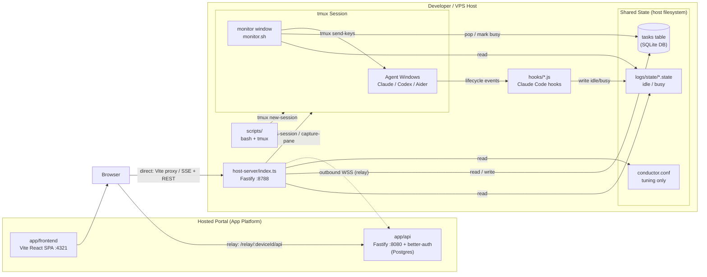
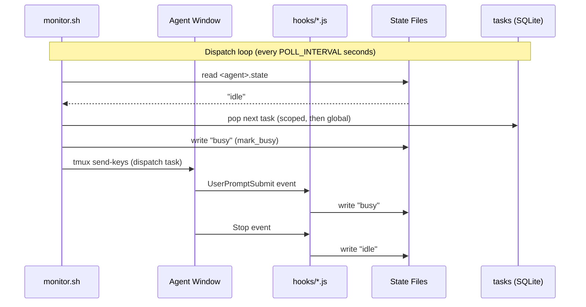

# tmux-conductor

A vendor-agnostic orchestration layer for running multiple AI coding agents (Claude Code, OpenAI Codex, Aider, etc.) in parallel from a single tmux session, with a real-time web dashboard and an optional hosted portal for driving sessions remotely.

**Repository:** https://github.com/codewizard-dt/tmux-conductor

## Quick Start

Install on the host that will run your agents:

```bash
curl -fsSL https://raw.githubusercontent.com/codewizard-dt/tmux-conductor/main/install.sh | bash
```

> **Heads up — hosted URL pending:** the `install.sh` bootstrap and the `conductor pair` CLI are **shipped** (the installer, the pairing client, the `device.json` writer, and the daemon relay connector all exist in the repo). What's still pending is the public **hosted deployment** (TASK-050) — the App Platform `api`/`frontend` aren't live yet, so the portal URL in the pairing step is your own deployment until the hosted instance goes live. To run everything locally instead, see [Run Locally](#run-locally).

### Onboarding flow (intended first-run experience)

1. **Get an invite code and sign up.** New accounts on the hosted portal are gated by an invite code. An admin mints codes (`POST /api/admin/invite-codes`); signup validates them (`POST /api/invite-codes/validate`).
2. **Install the host agent.** Run the one-liner above on the machine that will run your agents.
3. **Pair the daemon.** In the portal, generate a pairing code (`POST /api/pair/code` returns an `XXXX-XXXX` code with a 10-minute TTL). On the host, run:

   ```bash
   conductor pair --portal <portal-url> --code XXXX-XXXX
   ```

   This redeems the code (`POST /api/pair/redeem` -> `{ token, deviceId }`) and writes `$CONDUCTOR_HOME/device.json`. The daemon connector then dials the portal over an outbound WebSocket (`GET /relay/:deviceId`), so the host needs no inbound ports.

## Description

tmux-conductor solves the coordination problem that emerges when you want to run many AI coding agents simultaneously: how do you keep them all busy, avoid double-dispatching work, detect when one finishes, and shut everything down cleanly? The system uses tmux as its execution surface — each agent runs in its own window — and a polling monitor loop to detect idle state via per-agent state files (written by Claude Code lifecycle hooks) with a regex fallback for non-Claude CLIs.

The project has two halves:

- **The native conductor (`host-server/` + `scripts/`)** runs directly on the host. The shell layer (bash + tmux) handles agent lifecycle and task dispatch; the Fastify host-server exposes a real-time HTTP API and SSE stream for the dashboard.
- **The hosted portal (`app/api/` + `app/frontend/`)** is an optional public-facing layer that lets you drive a host's conductor from a browser anywhere. The browser talks to `app/api`, which relays conductor API calls to the host-server over an outbound WebSocket — no inbound ports on the host.

Tasks are stored in SQLite (at `DB_PATH`, default `data/conductor.db`), optionally scoped to a specific agent. The monitor pops tasks from the DB, pre-writes `busy` to the agent's state file to close the dispatch race window, sends the command via `tmux send-keys`, and then waits for the hook-written `idle` signal before dispatching the next task.

See [`CLAUDE.md`](CLAUDE.md) for the authoritative architecture reference and [`scripts/README.md`](scripts/README.md) for per-script usage and a flowchart.

## Architecture

### Overview

tmux-conductor is a layered orchestration system built on tmux as the process substrate. The architecture is deliberately file-centric on the host — per-agent state files on disk are the canonical idle/busy signal, so the monitor loop and the host-server coordinate without a message broker. The optional hosted portal adds remote access on top via an outbound relay, keeping the host free of inbound ports.

There are three deployable units:

- **`host-server/`** — runs **directly on the host/VPS, never Dockerized**. Managed by systemd in production (`deploy/host-server.service`).
- **`app/api/`** — deployed to DigitalOcean **App Platform** as a Docker service, backed by managed Postgres.
- **`app/frontend/`** — deployed to App Platform as a **static site**.

### Components

#### Orchestration Scripts (`scripts/`)

- **Responsibility:** Create and tear down the tmux session, spawn agent windows, and run the monitor dispatch loop.
- **Tech:** bash 4+, tmux 3+
- **Inputs:** `conductor.conf` (POLL_INTERVAL, detection patterns, usage checks, `DB_PATH` — tuning settings only), SQLite DB (agents, bg processes, task queue), per-agent state files
- **Outputs:** tmux windows, dispatched `send-keys` commands, JSONL dispatch log at `$LOG_DIR/dispatch.jsonl`
- **Depends on:** tmux, Claude Code hooks (for state files), bash 4+

#### Claude Code Hooks (`hooks/`)

- **Responsibility:** Write `idle`/`busy` to per-agent state files in response to Claude Code lifecycle events, providing the primary idle-detection signal.
- **Tech:** Node.js 22, stdlib only (no npm deps)
- **Inputs:** Claude Code lifecycle events (`SessionStart`, `UserPromptSubmit`, `Stop`, `StopFailure`) delivered via stdin as JSON
- **Outputs:** `$STATE_DIR/<agent>.state` (values: `idle`, `busy`), `$CONDUCTOR_LOG_DIR/hooks.jsonl`
- **Depends on:** Claude Code CLI (hook registration via `install-hooks.sh`)

#### Host-Server (`host-server/`)

- **Responsibility:** Serve the conductor HTTP API for agent status, task-queue CRUD, pane interaction, and live state updates via Server-Sent Events. Runs natively on the host, never containerized.
- **Tech:** Node.js 22, TypeScript, Fastify 5, `better-sqlite3`, tsx
- **Inputs:** HTTP requests on port 8788 (env `BACKEND_PORT`); `conductor.conf` (tuning only); SQLite DB; state files
- **Outputs:** JSON responses, SSE stream (`/events`) diff-broadcasting agent and session state every 2 seconds
- **Depends on:** tmux (for `has-session`, `capture-pane`, and pane-liveness checks), `conductor.conf`, state files, SQLite DB

#### Portal API (`app/api/`)

- **Responsibility:** Public-facing API for auth, invite-code signup gating, device pairing, and relaying conductor API calls from the browser to a paired host-server over an outbound WebSocket.
- **Tech:** Node.js 22, TypeScript, Fastify 5, better-auth, Postgres (`DATABASE_URL`)
- **Inputs:** HTTP requests on port 8080 (prod) / 8090 (local dev), env `API_PORT`; outbound WSS connections from host daemons (`GET /relay/:deviceId`)
- **Outputs:** Auth + pairing responses; relayed conductor API responses under `/relay/<deviceId>/api`
- **Depends on:** Postgres, the host-server (reached via the relay; in local Docker dev via `host.docker.internal:8788`, env `HOST_SERVER_URL`)

#### Dashboard Frontend (`app/frontend/`)

- **Responsibility:** Real-time browser UI for monitoring agent state and editing the task queue. Detects its runtime mode and routes API calls accordingly.
- **Tech:** Vite, React 19, TypeScript, dnd-kit (drag-and-drop), SSE client
- **Inputs:** SSE stream + REST. In **direct mode** it talks to the host-server through the Vite proxy / `VITE_API_URL`. In **relay mode** it routes conductor API calls through `/relay/<deviceId>/api`.
- **Outputs:** Rendered accordion agent list with per-agent state badges, drag-reorderable task lists, add-agent and add-task forms
- **Depends on:** host-server (direct mode) or portal API (relay mode)

### Component Interaction



### Data Flow



### Design Decisions

- **State via files, not IPC** — `<agent>.state` files are the canonical idle/busy signal; any process can read them without network or RPC, and they survive monitor restarts. State files do **not** age-expire; liveness is checked via `tmux display -p '#{pane_current_command}'`.
- **`mark_busy` pre-write** — the monitor writes `busy` immediately before dispatching a task to close the race between `send-keys` and the agent's `UserPromptSubmit` hook, preventing double-dispatch.
- **Regex fallback** — when a state file is missing, a regex match against `capture-pane` output decides idle/busy/awaiting, covering Aider/Codex (no hooks) and Claude-without-hooks.
- **Config vs data split** — `conductor.conf` holds only tuning settings (poll interval, detection patterns, usage checks, `DB_PATH`). All operational data (agents, bg processes, projects, task queue, schedules) lives in SQLite.
- **Outbound relay, no inbound ports** — the host-server never exposes a public port. The hosted portal reaches it over an outbound WebSocket dialed by the host daemon, so the host stays firewalled.
- **`send-keys -l` (literal mode)** — preserves special characters in prompts; `Enter` is always a separate call to avoid embedding it in the literal string.

## Technologies

**Runtime & Language**
- Node.js 22 (hooks, host-server, app/api)
- TypeScript 5 (host-server, app/api, app/frontend — run via tsx / built by Vite)
- bash 4+ (orchestration scripts)

**Frameworks & Libraries**
- Fastify 5 (host-server + portal API)
- better-auth (portal authentication)
- Vite + React 19 (dashboard SPA)
- `better-sqlite3` (host-server data layer)
- dnd-kit (`@dnd-kit/core`, `@dnd-kit/sortable`) — drag-and-drop task reordering
- tsx — TypeScript execution without a build step
- dotenv — environment variable loading

**Infrastructure**
- tmux 3+ — agent process substrate and pane management
- SQLite (`data/conductor.db`) — host-server operational data
- Postgres — portal API data store (`DATABASE_URL`)
- DigitalOcean App Platform — portal deploy (Docker service + static site + managed db, `deploy/app.yaml`)
- systemd — host-server process management in production (`deploy/host-server.service`)
- Docker Compose — local dev for `app/api` + `app/frontend` (`app/docker-compose.yml`)

**Tooling**
- ESLint 9
- TypeScript strict mode
- gitleaks (secret scanning, `.gitleaks.toml`)

## Use Cases

- **Parallelizing AI coding work across multiple agents** — configure several Claude Code or Aider instances, each pointed at a different part of the codebase, and let the monitor keep them all fed from a shared task queue.
- **Automated batch task execution** — enqueue dozens of prompts (tests to write, refactors to apply, docs to generate) via the dashboard or `scripts/add-task.sh`, and let the conductor run them unattended, respecting usage limits and cleaning up when done.
- **Remote operation via the hosted portal** — pair a host once, then monitor and drive its agents from a browser anywhere, with no inbound ports on the host.
- **Multi-vendor agent orchestration** — mix Claude Code, Codex, and Aider in the same session; hook-based idle detection handles Claude natively and `IDLE_PATTERN` regex handles everything else.

## Skills Demonstrated

- **tmux Scripting and Pane Lifecycle Management** — programmatic session creation, window spawning, `send-keys` dispatch, and `capture-pane` output parsing across multiple concurrent processes.
- **Event-Driven State Machine Design** — per-agent `idle`/`busy`/`awaiting` state transitions driven by Claude Code lifecycle hooks, with explicit race-condition handling (`mark_busy` pre-write) and pane-liveness detection.
- **Real-time API Design (Fastify 5 + SSE)** — diff-based Server-Sent Events stream broadcasting only changed agent state, with connection management and CORS handling for cross-origin SSE clients.
- **Outbound-Relay Remote Access** — a host-side daemon dials a public portal over WebSocket so a browser can drive a firewalled host without inbound ports, with device pairing and token issuance.
- **Auth & Onboarding Gating** — better-auth integration with invite-code signup gating and a pairing-code redemption flow.
- **TypeScript Full-Stack Development (Strict Mode)** — end-to-end TypeScript across the Fastify host-server, the portal API, and the Vite/React frontend.
- **Drag-and-Drop UI (dnd-kit)** — sortable task queue editor with pointer sensor integration and optimistic state updates via SSE.
- **Claude Code Hook Integration** — authoring and registering `SessionStart`, `UserPromptSubmit`, `Stop`, and `StopFailure` lifecycle hooks in Node.js with dedup-safe `~/.claude/settings.json` merge via `install-hooks.sh`.
- **Shell Script Portability (BSD/GNU)** — `sed -i.bak` compatibility, bash 4+ array handling, and macOS/Linux path differences handled throughout.

## Deployment

### Overview

There are two deployment targets:

- **Host-server + scripts** run **directly on the host/VPS** (never Dockerized), managed by systemd in production. `make deploy` ssh's to the VPS, `git pull`s, `npm ci`s, and restarts the `tmux-conductor-host-server.service` unit.
- **Portal (`app/api` + `app/frontend`)** deploys to **DigitalOcean App Platform** via `deploy/app.yaml` (an `api` Docker service, a `frontend` static site, and a managed Postgres `db`). `deploy_on_push: true` redeploys on push to `main`; `make deploy-app` forces a manual redeploy via `doctl`.

### Prerequisites

**For the native conductor (host):**
- tmux >= 3.0 (`brew install tmux` on macOS)
- bash >= 4.0 (macOS ships 3.2 — `brew install bash`)
- Node.js >= 22
- Claude Code CLI (for hook registration)
- `npm install` in `host-server/`

**For the hosted portal (App Platform / local Docker dev):**
- Postgres (`DATABASE_URL`)
- Docker (for `make docker-app`)
- `doctl` (for manual App Platform redeploys)

### Run Locally

```bash
# 1. Install host-server deps
cd host-server && npm install && cd ..

# 2. Install frontend deps
cd app/frontend && npm install && cd ..

# 3. Copy and configure environment
cp .env.example .env

# 4. Install Claude Code hooks (for Claude agents)
./install-hooks.sh

# 5. Start the conductor session (launches agents + bg processes from SQLite)
./scripts/conductor.sh
```

Run all three services concurrently (host-server, app/api, app/frontend) with:

```bash
make dev
```

Or run the portal half in Docker (host-server stays native):

```bash
make docker-app        # build + start app/api + app/frontend
make docker-app-down
```

Dashboard available at `http://localhost:4321`; host-server API on `http://localhost:8788`; portal API on `http://localhost:8090` (local dev).

### Deploy

```bash
# Host-server (native, systemd): pull + npm ci + restart on the VPS
make deploy

# Portal (App Platform): force a manual redeploy
make deploy-app
```

Pushing to `main` redeploys the portal automatically via App Platform (`deploy_on_push: true` in `deploy/app.yaml`).

### Data & Migrations

State is stored in a mix of SQLite and plain-text files on the host filesystem:
- `data/conductor.db` — SQLite database (via `better-sqlite3`): agents, background processes, projects, task queue, schedules
- `logs/state/<agent>.state` — per-agent idle/busy state
- `logs/dispatch.jsonl` — append-only dispatch audit log
- `logs/hooks.jsonl` — append-only hook transition log

The portal API stores auth, invite codes, and device-pairing records in Postgres (`DATABASE_URL`).

To reset the task queue: clear the `tasks` table in `data/conductor.db`. To reset agent state: delete `logs/state/*.state`.

### Health Checks & Smoke Tests

```bash
# Host-server health check
curl http://localhost:8788/healthz

# Per-agent state snapshot
curl http://localhost:8788/status
```

### Observability

- **Dispatch log:** `logs/dispatch.jsonl` — one JSONL record per dispatch (`ts`, `agent`, `command`, `state`, `state_age_s`, `detection`, `queue`, `queue_remaining`, `pane_tail`).
- **Hook log:** `logs/hooks.jsonl` — one JSONL record per state transition (`ts`, `agent`, `event`, `prev_state`, `new_state`).
- **Host-server (systemd):** `journalctl -u tmux-conductor-host-server.service -f`.
- **Portal logs (App Platform):** `doctl apps logs <app-id>` or the App Platform dashboard.

### Troubleshooting

- **Monitor double-dispatches tasks** → state file is missing or stale. Verify `install-hooks.sh` has been run and Claude Code hooks are registered (`~/.claude/settings.json` should contain entries pointing at `~/.claude/hooks/tmux-conductor/`).
- **Agent never goes idle** → `IDLE_PATTERN` regex doesn't match the CLI's prompt. Check the last few lines of the agent pane with `tmux capture-pane -pt conductor:agent-name` and update `IDLE_PATTERN` in `conductor.conf`.
- **Dashboard shows stale agent state** → the host-server reads state files on every SSE poll (2s). Confirm the dashboard is pointed at the right host-server (direct mode: `VITE_API_URL` / Vite proxy; relay mode: the paired `deviceId`).
- **`conductor.sh` fails with "kill-session: session not found"** → safe to ignore; this is the pre-flight cleanup for an already-absent session. The script continues normally.
- **Browser can't reach a paired host** → confirm the host daemon's outbound WebSocket to `app/api` (`GET /relay/:deviceId`) is connected and `device.json` holds a valid token.
