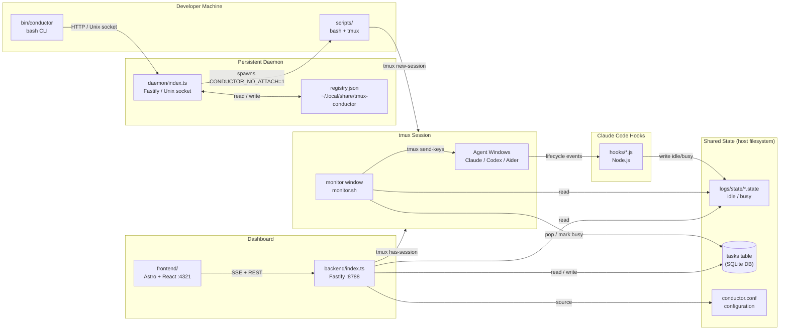
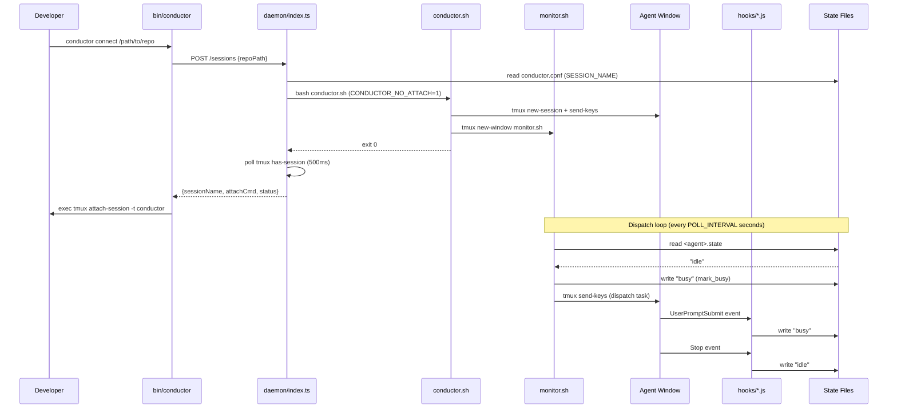

# tmux-conductor

A vendor-agnostic orchestration layer for running multiple AI coding agents (Claude Code, OpenAI Codex, Aider, etc.) in parallel from a single tmux session, with a real-time web dashboard and a persistent daemon for on-demand session management.

**Repository:** https://github.com/codewizard-dt/tmux-conductor

## Description

tmux-conductor solves the coordination problem that emerges when you want to run many AI coding agents simultaneously: how do you keep them all busy, avoid double-dispatching work, detect when one finishes, and shut everything down cleanly? The system uses tmux as its execution surface — each agent runs in its own window — and a polling monitor loop to detect idle state via per-agent state files (written by Claude Code lifecycle hooks) with a regex fallback for non-Claude CLIs.

The project is structured in three layers. The shell layer (bash scripts + tmux) handles agent lifecycle and task dispatch. The dashboard layer (Fastify HTTP server + Astro/React UI) provides real-time visibility and a task-queue editor accessible from the browser. The daemon layer (a persistent Unix-socket server and `bin/conductor` CLI) enables on-demand session creation across multiple repos without manual shell invocation — you run `conductor connect /path/to/project` from anywhere and it starts or reattaches to the right session.

Tasks are stored in SQLite (at `DB_PATH`, default `data/conductor.db`), optionally scoped to a specific agent. The monitor pops tasks from the DB, pre-writes `busy` to the agent's state file to close the dispatch race window, sends the command via `tmux send-keys`, and then waits for the hook-written `idle` signal before dispatching the next task.

## Architecture

### Overview

tmux-conductor is a layered orchestration system built on tmux as the process substrate, with three independent server processes (monitor loop, HTTP dashboard, Unix-socket daemon) coordinating through shared state files on disk. The architecture is deliberately simple and file-centric — no message broker, no persistent database, no container isolation — so it runs directly on the developer's host with minimal infrastructure.

### Components

#### Orchestration Scripts (`scripts/`)

- **Responsibility:** Create and tear down the tmux session, spawn agent windows, and run the monitor dispatch loop.
- **Tech:** bash 4+, tmux 3+
- **Inputs:** `conductor.conf` (BG_PROCESSES, POLL_INTERVAL, tuning settings), SQLite DB (agents, task queue), per-agent state files
- **Outputs:** tmux windows, dispatched `send-keys` commands, JSONL dispatch log at `$LOG_DIR/dispatch.jsonl`
- **Depends on:** tmux, Claude Code hooks (for state files), bash 4+

#### Claude Code Hooks (`hooks/`)

- **Responsibility:** Write `idle`/`busy` to per-agent state files in response to Claude Code lifecycle events, providing the primary idle-detection signal.
- **Tech:** Node.js 22, stdlib only (no npm deps)
- **Inputs:** Claude Code lifecycle events (`SessionStart`, `UserPromptSubmit`, `Stop`, `StopFailure`) delivered via stdin as JSON
- **Outputs:** `$STATE_DIR/<agent>.state` (values: `idle`, `busy`), `$CONDUCTOR_LOG_DIR/hooks.jsonl`
- **Depends on:** Claude Code CLI (hook registration via `install-hooks.sh`)

#### Dashboard Backend (`backend/`)

- **Responsibility:** Serve an HTTP API for agent status, task-queue CRUD, and live state updates via Server-Sent Events.
- **Tech:** Node.js 22, TypeScript, Fastify 5, tsx
- **Inputs:** HTTP requests on port 8788; `conductor.conf` (parsed via bash `declare -p`); SQLite DB (agents, task queue); state files
- **Outputs:** JSON responses, SSE stream (`/api/events`) diff-broadcasting agent and session state changes every 2 seconds
- **Depends on:** tmux (for `has-session` and `capture-pane` checks), `conductor.conf`, state files

#### Dashboard Frontend (`frontend/`)

- **Responsibility:** Real-time browser UI for monitoring agent state and editing the task queue.
- **Tech:** Astro 6, React 19, TypeScript, dnd-kit (drag-and-drop), SSE client
- **Inputs:** SSE stream from backend (`/api/events`); REST endpoints for queue mutations
- **Outputs:** Rendered accordion agent list with per-agent state badges, drag-reorderable task lists, add-agent and add-task forms
- **Depends on:** Dashboard backend

#### Global Daemon (`daemon/`)

- **Responsibility:** Persistent Unix-socket HTTP server that manages a registry of active conductor sessions across multiple repos, starting new sessions on demand without manual shell invocation.
- **Tech:** Node.js 22, TypeScript, Fastify 5, tsx
- **Inputs:** HTTP requests via `~/.local/share/tmux-conductor/daemon.sock`; `conductor.conf` per repo (sourced via bash); `~/.local/share/tmux-conductor/registry.json`
- **Outputs:** tmux sessions (via `conductor.sh` with `CONDUCTOR_NO_ATTACH=1`), updated registry JSON
- **Depends on:** tmux, `scripts/conductor.sh`, `scripts/teardown.sh`

#### Conductor CLI (`bin/conductor`)

- **Responsibility:** Shell client for the daemon — start, connect, list, and stop conductor sessions from any directory.
- **Tech:** bash, curl (Unix-socket mode), python3 (JSON parsing)
- **Inputs:** Subcommands (`start`, `connect`, `list`, `stop`, `daemon start/stop/status/install`)
- **Outputs:** Session info, tmux attach (via `exec tmux attach-session`)
- **Depends on:** Global daemon (auto-starts it if not running)

### Component Interaction



### Data Flow



### Design Decisions

- **State via files, not IPC** — `<agent>.state` files are the canonical idle/busy signal; any process can read them without network or RPC, and they survive monitor restarts.
- **`mark_busy` pre-write** — the monitor writes `busy` immediately before dispatching a task to close the race between `send-keys` and the agent's `UserPromptSubmit` hook, preventing double-dispatch.
- **Stale-state fallback** — idle state older than `2 × POLL_INTERVAL` is distrusted and triggers a regex match against `capture-pane` output, covering Aider/Codex (no hooks) and Esc-interrupted Claude sessions.
- **Unix socket for daemon** — the daemon IPC uses `~/.local/share/tmux-conductor/daemon.sock` (HTTP over Unix domain socket) so no port conflicts and access is automatically scoped to the owning user.
- **`CONDUCTOR_NO_ATTACH=1`** — lets `conductor.sh` create a session without blocking the daemon on `tmux attach-session`, keeping the HTTP request non-blocking.
- **`send-keys -l` (literal mode)** — preserves special characters in prompts; `Enter` is always a separate call to avoid embedding it in the literal string.

## Technologies

**Runtime & Language**
- Node.js 22 (hooks, backend, daemon)
- TypeScript 5 (backend, daemon — run via tsx, not compiled)
- bash 4+ (orchestration scripts)

**Frameworks & Libraries**
- Fastify 5 (HTTP backend + daemon server)
- Astro 6 (frontend meta-framework)
- React 19 (dashboard UI components)
- dnd-kit (`@dnd-kit/core`, `@dnd-kit/sortable`) — drag-and-drop task reordering
- tsx — TypeScript execution without a build step
- dotenv — environment variable loading

**Infrastructure**
- tmux 3+ — agent process substrate and pane management
- Docker (node:22-alpine multi-stage build)
- Docker Compose — production deployment
- GitHub Container Registry (GHCR) — image distribution
- GitHub Actions — CI/CD (build + push on `main`, deploy via self-hosted runner)

**Tooling**
- ESLint 9 (backend + frontend)
- TypeScript strict mode
- gitleaks (secret scanning, `.gitleaks.toml`)

## Use Cases

- **Parallelizing AI coding work across multiple agents** — configure several Claude Code or Aider instances, each pointed at a different part of the codebase, and let the monitor keep them all fed from a shared task queue.
- **Automated batch task execution** — enqueue dozens of prompts (tests to write, refactors to apply, docs to generate) via the dashboard or `scripts/add-task.sh`, and let the conductor run them unattended, respecting usage limits and cleaning up when done.
- **On-demand session management** — run `conductor connect .` from any project directory to start (or reattach to) an existing conductor session without manually sourcing config or remembering tmux session names.
- **Multi-vendor agent orchestration** — mix Claude Code, Codex, and Aider in the same session; hook-based idle detection handles Claude natively and `IDLE_PATTERN` regex handles everything else.

## Skills Demonstrated

- **tmux Scripting and Pane Lifecycle Management** — programmatic session creation, window spawning, `send-keys` dispatch, and `capture-pane` output parsing across multiple concurrent processes.
- **Event-Driven State Machine Design** — per-agent `idle`/`busy`/`awaiting` state transitions driven by Claude Code lifecycle hooks, with explicit race-condition handling (`mark_busy` pre-write) and stale-state detection.
- **Real-time API Design (Fastify 5 + SSE)** — diff-based Server-Sent Events stream broadcasting only changed agent state, with connection management and CORS handling for cross-origin SSE clients.
- **TypeScript Full-Stack Development (Strict Mode)** — end-to-end TypeScript across Fastify backend and Astro/React frontend, with `noEmit` + `allowImportingTsExtensions` for tsx-based development.
- **IPC via Unix Domain Sockets** — persistent Fastify daemon listening on a Unix socket with curl-addressable HTTP API, enabling cross-process session management without port allocation.
- **Drag-and-Drop UI (dnd-kit)** — sortable task queue editor with pointer sensor integration and optimistic state updates via SSE.
- **Multi-Stage Docker Build Optimization** — three-stage Dockerfile separating UI build, production dependency installation, and runtime to minimize image size.
- **CI/CD Pipeline Configuration (GitHub Actions)** — automated build, GHCR push, and self-hosted runner deployment on `main` push with Docker layer caching.
- **Claude Code Hook Integration** — authoring and registering `UserPromptSubmit`, `Stop`, and `StopFailure` lifecycle hooks in Node.js with dedup-safe `~/.claude/settings.json` merge via `install-hooks.sh`.
- **Shell Script Portability (BSD/GNU)** — `sed -i.bak` compatibility, bash 4+ array handling, and macOS/Linux path differences handled throughout.

## Deployment

### Overview

The dashboard (Fastify backend + bundled Astro UI) ships as a single Docker image (`ghcr.io/codewizard-dt/tmux-conductor-dashboard`) deployed via Docker Compose on a self-hosted Linux runner. CI/CD is fully automated via GitHub Actions on push to `main`. The shell orchestration scripts and daemon run on the developer's local machine (host-side only, not containerized).

### Prerequisites

**For the dashboard container:**
- Docker 24+ and Docker Compose v2
- Access to GHCR (public image, no auth required for pull)
- A host running the tmux conductor session (the container mounts `conductor.conf`, `logs/state/`, and `data/` from the host)

**For local orchestration:**
- tmux >= 3.0 (`brew install tmux` on macOS)
- bash >= 4.0 (macOS ships 3.2 — `brew install bash`)
- Node.js >= 22
- Claude Code CLI (for hook registration)
- `npm install` in `backend/` and `frontend/`

**For the daemon:**
- `npm install` in `daemon/`
- macOS: launchd (included) for auto-start via `conductor daemon install`

### Environment Variables

| Variable | Required | Example | Description |
|---|---|---|---|
| `BACKEND_PORT` | no | `8788` | Port the Fastify backend listens on |
| `HOST` | no | `0.0.0.0` | Bind address (use `127.0.0.1` to restrict to localhost) |
| `CORS_ORIGIN` | no | `http://localhost:4321` | Allowed CORS origin for the backend |
| `PUBLIC_API_URL` | build-time | `http://localhost:8788/api` | Backend API URL baked into the Astro frontend build |
| `CONDUCTOR_CONF` | no | `/app/conductor.conf` | Override path to `conductor.conf` (container use) |
| `UID` / `GID` | no | `1000` | User/group for the container process |

### Build

```bash
# Build the production Docker image (frontend bundled inside)
docker build \
  --build-arg PUBLIC_API_URL=http://your-host:8788/api \
  -f Dockerfile.prod \
  -t tmux-conductor-dashboard:local .
```

The multi-stage build produces a `node:22-alpine` image (~150 MB) with the Astro UI pre-built into `ui/dist` and served statically by Fastify.

### Run Locally

```bash
# 1. Install backend deps
cd backend && npm install && cd ..

# 2. Install frontend deps
cd frontend && npm install && cd ..

# 3. Install daemon deps
cd daemon && npm install && cd ..

# 4. Copy and configure environment
cp .env.example .env

# 5. Install Claude Code hooks (for Claude agents)
./install-hooks.sh

# 6. Start the conductor session (launches agents + dashboard BG_PROCESSES)
./scripts/conductor.sh

# Or use the daemon for on-demand session management:
./bin/conductor daemon start
./bin/conductor connect .   # starts session and attaches
```

Dashboard available at `http://localhost:4321` (frontend dev) or `http://localhost:8788` (production image).

### Deploy

The production container is deployed via Docker Compose on a self-hosted runner. GitHub Actions handles the full pipeline:

1. **CI triggers** — any push to `main` starts the `Build & Push` workflow (`.github/workflows/build.yml`).
2. **Build** — multi-stage Docker build with `PUBLIC_API_URL` injected at build time.
3. **Push** — image pushed to GHCR as `ghcr.io/codewizard-dt/tmux-conductor-dashboard:latest` and `:<version>` (from `backend/package.json`).
4. **Deploy** — self-hosted runner job (`runs-on: [self-hosted, prod]`) pulls the new image and restarts the stack:

```bash
# Triggered automatically by CI, or run manually on the host:
docker compose pull
docker compose up -d --wait
```

The `dashboard` service mounts `conductor.conf`, `logs/state/`, and `data/` from the host so the container reads live agent state and the SQLite task queue without needing access to the tmux session itself.

### Data & Migrations

State is stored in a mix of SQLite and plain-text files on the host filesystem:
- `data/conductor.db` — SQLite database: agents, background processes, agent↔bg links, task queue
- `logs/state/<agent>.state` — per-agent idle/busy state
- `logs/dispatch.jsonl` — append-only dispatch audit log
- `~/.local/share/tmux-conductor/registry.json` — daemon session registry (auto-reconciled against `tmux ls` on startup)

To reset the task queue: delete or clear the tasks table in `data/conductor.db`. To reset agent state: delete `logs/state/*.state`.

### Health Checks & Smoke Tests

```bash
# Backend health check (container and host)
curl http://localhost:8788/api/healthz
# Expected: {"ok":true}

# Dashboard container health (Docker)
docker compose ps   # dashboard should show "healthy"

# Daemon health check
./bin/conductor daemon status
# Expected: "Daemon is running. Socket: ~/.local/share/tmux-conductor/daemon.sock"

# Agent state
./bin/conductor list   # lists active sessions
curl http://localhost:8788/api/status   # per-agent state snapshot
```

### Rollback

```bash
# Roll back the container to the previous image version
docker compose pull ghcr.io/codewizard-dt/tmux-conductor-dashboard:<previous-version>
# Edit docker-compose.yml to pin the image tag, then:
docker compose up -d --wait
```

For the shell scripts and daemon (not containerized), roll back via git:

```bash
git checkout <previous-commit> -- scripts/ daemon/ bin/ hooks/
```

### Observability

- **Dispatch log:** `logs/dispatch.jsonl` — one JSONL record per dispatch (`ts`, `agent`, `command`, `state`, `state_age_s`, `detection`, `queue`, `queue_remaining`, `pane_tail`).
- **Hook log:** `logs/hooks.jsonl` — one JSONL record per state transition (`ts`, `agent`, `event`, `prev_state`, `new_state`).
- **Daemon log:** `~/.local/share/tmux-conductor/daemon.log` — stdout/stderr from the daemon process.
- **Container logs:** `docker compose logs -f dashboard`
- No external metrics or alerting configured.

### Troubleshooting

- **`conductor connect .` returns "Error: daemon returned empty response"** → daemon is not running. Run `./bin/conductor daemon start` and check `~/.local/share/tmux-conductor/daemon.log`.
- **Monitor double-dispatches tasks** → state file is missing or stale. Verify `install-hooks.sh` has been run and Claude Code hooks are registered (`~/.claude/settings.json` should contain entries pointing at `~/.claude/hooks/tmux-conductor/`).
- **Agent never goes idle** → `IDLE_PATTERN` regex doesn't match the CLI's prompt. Check the last 5 lines of the agent pane with `tmux capture-pane -pt conductor:agent-name` and update `IDLE_PATTERN` in `conductor.conf`.
- **Dashboard shows stale agent state** → the backend reads state files on every SSE poll (2s). Confirm `logs/state/` is mounted correctly in `docker-compose.yml` if running containerized.
- **`conductor.sh` fails with "kill-session: session not found"** → safe to ignore; this is the pre-flight cleanup for an already-absent session. The script continues normally.
- **`tmux: no server running`** in daemon log on startup** → expected; `reconcileRegistry()` calls `tmux ls` and catches the error when no tmux server is active. The daemon starts successfully regardless.
