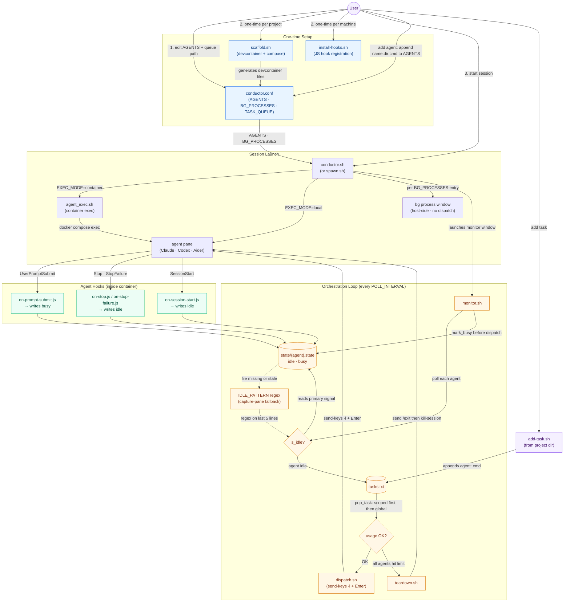

# tmux-conductor — Full Workflow

> Auto-generated from `CLAUDE.md`, `conductor.conf`, and `scripts/README.md` by `/mermaid-flowchart`.

## Notes

- **Adding a new agent**: add one line to the `AGENTS` array in `conductor.conf` using the format `name:workdir:launch_cmd`, then restart the conductor session (`teardown.sh` → `conductor.sh`). For container mode, also run `scaffold.sh` inside the new project directory first.
- **Adding a new task**: run `add-task.sh <command>` from inside the target project directory — it prefixes the line with the project name as scope. Alternatively, manually append `agentname: command` (scoped) or a bare command (global) to `tasks.txt`. The monitor picks it up on the next poll.
- The dashed edges from `StateFile` → `IdlePattern` → `IdleCheck` represent the fallback path: it only activates when the state file is absent or older than `2 × POLL_INTERVAL` (covers non-Claude agents like Aider, or the Esc-interrupt case).
- `BgPane` windows receive no queue dispatches and do not affect the `all_idle` / shutdown decision — they are only terminated via `C-c` during `teardown.sh`.
