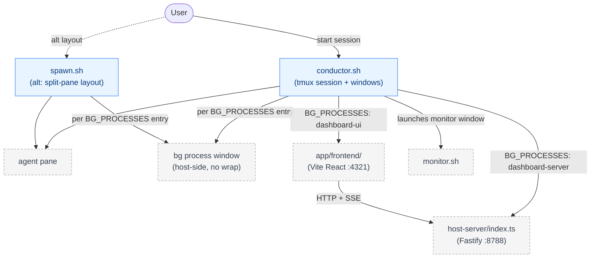
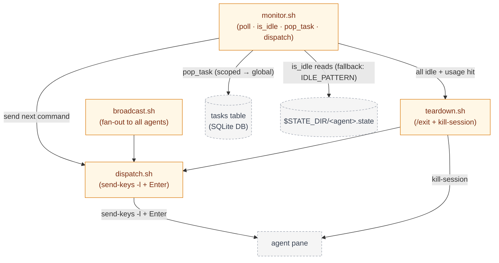
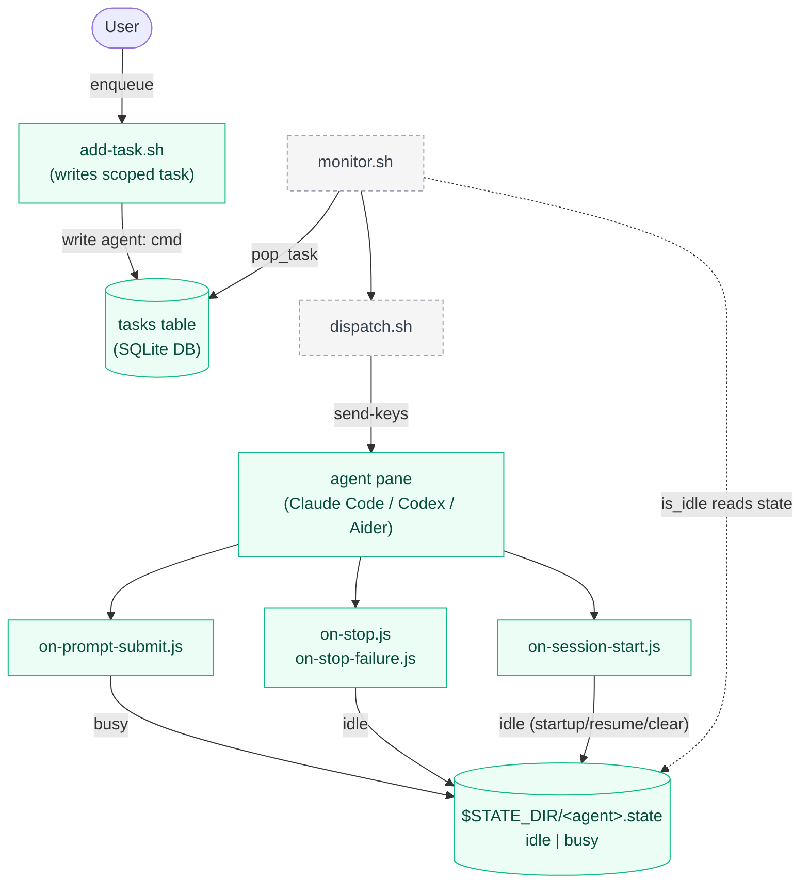

# scripts/

Orchestration scripts for tmux-conductor. This directory contains every shell entry point the user or the monitor invokes at runtime. Configuration lives one level up in `../conductor.conf`; hook scripts (Node.js) live in `../hooks/`.

See also: [`../CLAUDE.md`](../CLAUDE.md) for the full project overview and [`../conductor.conf`](../conductor.conf) for configurable env vars.

## Architecture

Three views of the same system. **Setup / Entry** is how a user launches the tmux session. **Orchestration loop** is the monitor polling agents and dispatching commands. **Task lifecycle** is how a task travels from `add-task.sh` through the queue to an agent pane and back via hooks. Nodes with a dashed outline are owned by another view and shown only as context.

### Setup / Entry



### Orchestration loop



### Task lifecycle



## conductor.sh

Entry point for a conductor session. Creates the tmux session named `$SESSION_NAME`, spawns one window per entry in `AGENTS`, and launches the `monitor` window running `monitor.sh`. Reads `SESSION_NAME`, `BG_PROCESSES`, `STATE_DIR`, and `LOG_DIR` from `../conductor.conf`. Agents are loaded from SQLite via `load_agents()`.

Each entry in `BG_PROCESSES` also gets its own tmux window, created after the agent windows and before the monitor window. Bg processes run on the **host** (no `CONDUCTOR_AGENT_NAME` env prefix) so things like `pnpm dev` execute in the same shell environment as the user's dev workflow.

Usage:
```
scripts/conductor.sh
```

## spawn.sh

Split-pane alternative to `conductor.sh`. Reads the same configuration but lays agents out within a single window using `tmux split-window` + `select-layout tiled` instead of separate windows. Useful when you want all agent panes on one screen at a glance. Also splits one pane per `BG_PROCESSES` entry (host-side) at the end of the agent splits.

Usage:
```
scripts/spawn.sh
```

## monitor.sh

The main polling loop. Every `POLL_INTERVAL` seconds it checks each agent with `is_idle` — primarily by reading `$STATE_DIR/<agent>.state` (written by the Node.js hooks), falling back to the `IDLE_PATTERN` regex against `capture-pane` output when the state file is missing or stale. On idle, it calls `pop_task_sql` against the SQLite DB (scoped tasks first, then global) and hands the command to `dispatch.sh`. When the queue is empty for a given agent, the agent simply stays idle — there is no default-command fallback. Appends a JSONL record per dispatch to `$LOG_DIR/dispatch.jsonl` and inline logs to `$LOG_DIR/monitor-*.log`. When every agent is idle AND `USAGE_CHECK_CMD` fails for every agent, it auto-invokes `teardown.sh`.

Each poll also runs a liveness check over `BG_PROCESSES` window names: if `tmux has-session -t "$SESSION_NAME:$bg_name"` fails, monitor logs `WARN: bg '<name>' — window not found`. Bg processes are never dispatched to and never affect the `all_idle`/`all_usage_hit` shutdown decision.

Usage:
```
scripts/monitor.sh
```

## dispatch.sh

Sends a single command to a single tmux target pane. Uses `tmux send-keys -l` (literal mode) to preserve special characters in prompts, followed by a separate `Enter` keypress — never embedded in the literal string. Called by `monitor.sh`, `broadcast.sh`, and `teardown.sh`.

Usage:
```
scripts/dispatch.sh <target> <command>
```

## broadcast.sh

Fan-out wrapper. Iterates over `AGENTS` and invokes `dispatch.sh` for each pane that currently exists in the session. Useful for sending `/clear`, `/status`, or any command to every agent at once.

Usage:
```
scripts/broadcast.sh <command>
```

## teardown.sh

Graceful shutdown. Sends `/exit` to each agent via `dispatch.sh`, then sends `C-c` (`tmux send-keys ... C-c`) to every `BG_PROCESSES` window so dev servers / watchers get a chance to clean up, sleeps ~10 seconds to let both agents and bg processes flush, then runs `tmux kill-session` on `$SESSION_NAME`. Takes no arguments.

Usage:
```
scripts/teardown.sh
```

## add-task.sh

Convenience enqueuer for the task queue. Uses `basename "$PWD"` as the agent-scope prefix and writes a scoped task `<agent>: <command>` to the SQLite DB. Intended to be run (or aliased) from within the target project directory so scoped tasks land on the right agent without manual prefixing.

Usage:
```
scripts/add-task.sh <command words...>
```

## Archived Scripts

The following scripts are preserved in `scripts/.archive/` for reference but are no longer part of the active system:

- `scaffold.sh` — generated `devcontainer-compose.yml` and `.devcontainer/devcontainer.json`; superseded by local-agent model (ROADMAP-001)
- `agent_exec.sh` — host-side container exec wrapper; superseded by local-agent model (ROADMAP-001)

## host-server/ (repo root, was `backend/`)

The native Fastify HTTP server backing the Vite React dashboard. Runs on `127.0.0.1:8788` (env `BACKEND_PORT`). Runs **directly on the host/VPS, never Dockerized** — in dev via a dedicated tmux window (`BG_PROCESSES`) or `make dev`, in production under systemd. All operational data (agents, queue, bg processes, projects, schedules) lives in SQLite and is accessed through `host-server/db.ts`.

| File | Purpose |
|------|---------|
| `host-server/index.ts` | Fastify app: `GET /status`, `GET /agents`, `GET\|POST /queue/:agent`, `PUT /queue/:agent/reorder`, `DELETE /queue/:agent/:index`, `GET /agents/:agent/tail`, `POST /agents/:agent/keys`, `POST /agents/:agent/upload`, `GET /skills`, `GET /agents/:agent/skills`, `GET /events` (SSE), `GET /healthz` |
| `host-server/config.ts` | Reads and parses `conductor.conf` (tuning settings only) and resolves `DB_PATH` / state dir relative to the conf file |
| `host-server/db.ts` | better-sqlite3 data layer — agents, queue, bg processes, projects, schedules |
| `host-server/state.ts` | Pane-liveness and agent-state helpers used by status detection |

Usage:
```
cd host-server && npm start
```

## app/frontend/ (was `frontend/`)

The Vite React single-page app that consumes the host-server. Runs on `localhost:4321` (env `FRONTEND_PORT`). Displays a real-time accordion list of agents with state indicators and an inline queue editor; subscribes to the `GET /events` SSE stream for live updates. The Vite dev proxy splits `/api/*`: auth/portal prefixes (`/api/auth`, `/api/invite-codes`, `/api/admin/invite-codes`, `/api/devices`, `/api/pair`) go to `app/api`, everything else under `/api/*` goes to the host-server on :8788.

Usage:
```
cd app/frontend && npm run dev
```

Open `http://localhost:4321` in your browser.

## Remote access (relay & pairing)

For remote/hosted access, `app/api` (Fastify + better-auth + Postgres, App Platform) fronts the host-server: browser → `app/api` → outbound **WSS** → daemon relay connector → host-server (:8788). New users sign up behind **invite-code gating** (`POST /api/admin/invite-codes` mints, `POST /api/invite-codes/validate` checks). Both halves are shipped: the server-side pairing endpoints (`POST /api/pair/code`, `POST /api/pair/redeem`) **and** the **pairing client** — `conductor pair --portal <url> --code XXXX-XXXX` (the `pair)` subcommand in `bin/conductor`, which calls `daemon/pair.ts`), the `device.json` writer (`daemon/credentials.ts`, writing `$CONDUCTOR_HOME/device.json`), the daemon relay connector (`daemon/connector.ts`, dialing `GET /relay/:deviceId` over outbound WSS), and the `install.sh` bootstrap (repo root) that runs the optional pairing step. The only pending item is the live public App Platform deployment (TASK-050) — the hosted portal URL isn't up yet. **Note:** `bin/conductor` is the user-facing CLI (`install`, `daemon`, `pair`, `unpair`) and is distinct from `scripts/conductor.sh`, the tmux session orchestrator. See [`../CLAUDE.md`](../CLAUDE.md) for the full relay data path.

---

## Going-forward summary

| Script | Going forward? |
|--------|---------------|
| `conductor.sh` | **Essential** |
| `spawn.sh` | **Essential** |
| `monitor.sh` | **Essential** |
| `dispatch.sh` | **Essential** |
| `broadcast.sh` | **Useful** |
| `teardown.sh` | **Essential** |
| `add-task.sh` | **Useful** |
| `host-server/` | **Active** |
| `app/frontend/` | **Active** |
| `app/api/` (relay + auth) | **Active** |
| `.archive/scaffold.sh` | **Archived — Docker era** |
| `.archive/agent_exec.sh` | **Archived — Docker era** |

---

## See also

- [`../CLAUDE.md`](../CLAUDE.md)
- [`../conductor.conf`](../conductor.conf)
- [`../hooks/`](../hooks/)
- [`../hooks/README.md`](../hooks/README.md)
- [`../install-hooks.sh`](../install-hooks.sh)
- [`../SCRIPTS_GLOSSARY.md`](../SCRIPTS_GLOSSARY.md)
- [`../wiki/work/tasks/index.md`](../wiki/work/tasks/index.md)
