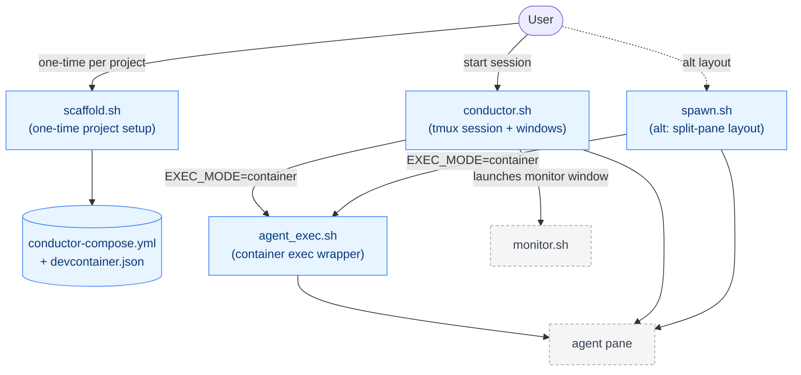
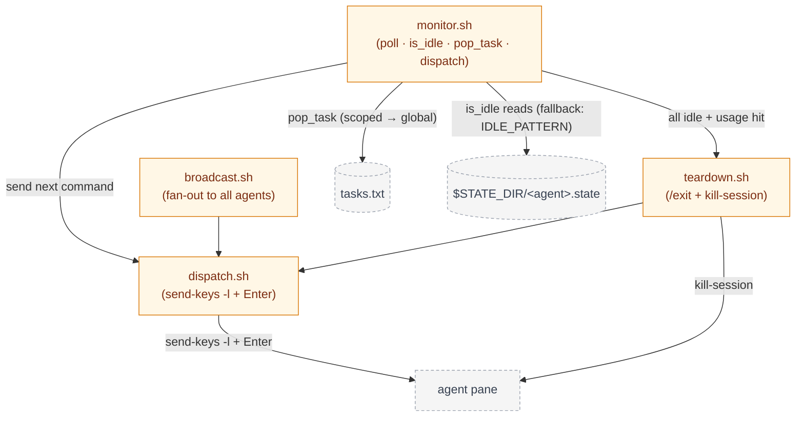
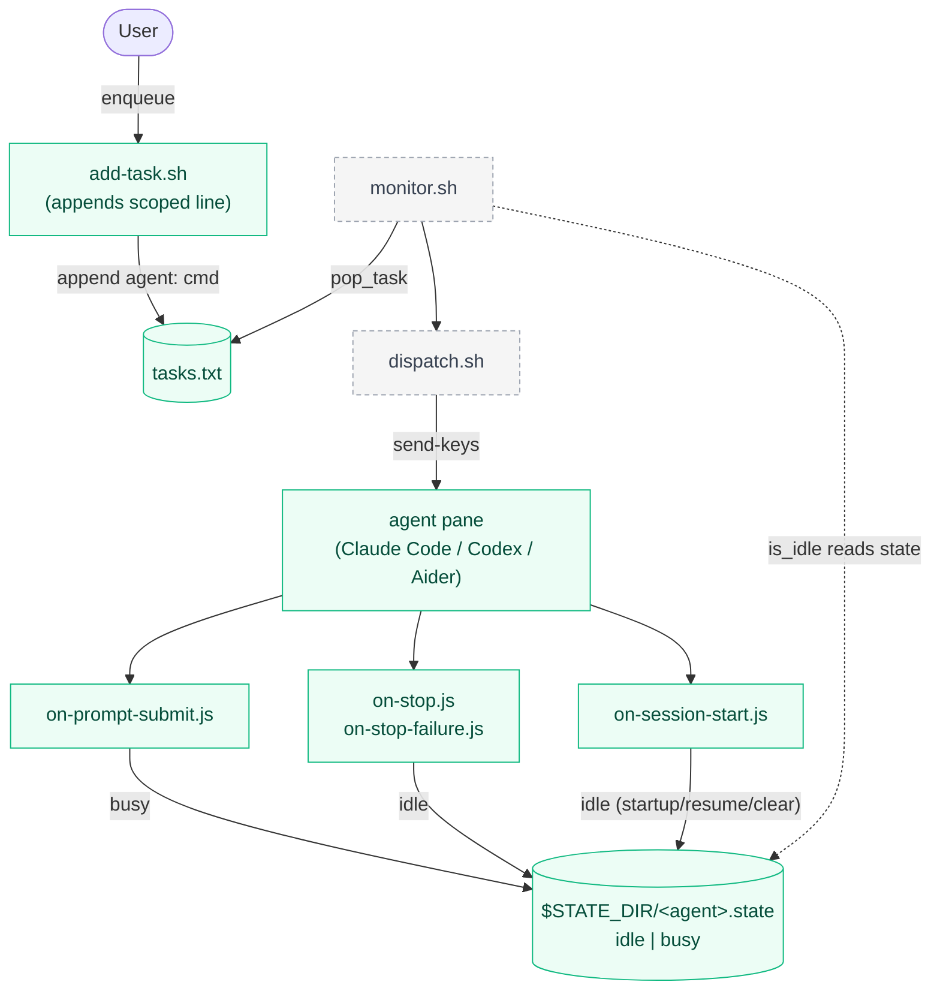

# scripts/

Orchestration scripts for tmux-conductor. This directory contains every shell entry point the user or the monitor invokes at runtime. Configuration lives one level up in `../conductor.conf`; hook scripts (Node.js) live in `../hooks/`.

See also: [`../CLAUDE.md`](../CLAUDE.md) for the full project overview and [`../conductor.conf`](../conductor.conf) for configurable env vars.

## Architecture

Three views of the same system. **Setup / Entry** is how a user turns a project into an agent-ready container and launches the tmux session. **Orchestration loop** is the monitor polling agents and dispatching commands. **Task lifecycle** is how a task travels from `add-task.sh` through the queue to an agent pane and back via hooks. Nodes with a dashed outline are owned by another view and shown only as context.

### Setup / Entry



### Orchestration loop



### Task lifecycle



## conductor.sh

Entry point for a conductor session. Creates the tmux session named `$SESSION_NAME`, spawns one window per entry in `AGENTS`, and launches the `monitor` window running `monitor.sh`. Reads `SESSION_NAME`, `AGENTS`, `EXEC_MODE`, `STATE_DIR`, and `LOG_DIR` from `../conductor.conf`. When `EXEC_MODE=container`, performs a pre-flight check for `~/.conductor_env` and routes each agent launch through `agent_exec.sh`.

Usage:
```
scripts/conductor.sh
```

## spawn.sh

Split-pane alternative to `conductor.sh`. Reads the same configuration but lays agents out within a single window using `tmux split-window` + `select-layout tiled` instead of separate windows. Useful when you want all agent panes on one screen at a glance.

Usage:
```
scripts/spawn.sh
```

## monitor.sh

The main polling loop. Every `POLL_INTERVAL` seconds it checks each agent with `is_idle` — primarily by reading `$STATE_DIR/<agent>.state` (written by the Node.js hooks), falling back to the `IDLE_PATTERN` regex against `capture-pane` output when the state file is missing or stale. On idle, it calls `pop_task` against `TASK_QUEUE` (scoped lines first, then global) and hands the command to `dispatch.sh`. Appends a JSONL record per dispatch to `$LOG_DIR/dispatch.jsonl` and inline logs to `$LOG_DIR/monitor-*.log`. When every agent is idle AND `USAGE_CHECK_CMD` fails for every agent, it auto-invokes `teardown.sh`.

Usage:
```
scripts/monitor.sh
```

## dispatch.sh

Sends a single command to a single tmux target pane. Uses `tmux send-keys -l` (literal mode) to preserve special characters in prompts, followed by a separate `Enter` keypress — never embedded in the literal string. Called by `monitor.sh`, `broadcast.sh`, and `teardown.sh`.

Usage:
```
scripts/dispatch.sh <target> <command>
```

## broadcast.sh

Fan-out wrapper. Iterates over `AGENTS` and invokes `dispatch.sh` for each pane that currently exists in the session. Useful for sending `/clear`, `/status`, or any command to every agent at once.

Usage:
```
scripts/broadcast.sh <command>
```

## teardown.sh

Graceful shutdown. Sends `/exit` to each agent via `dispatch.sh`, sleeps ~10 seconds to let agents flush, then runs `tmux kill-session` on `$SESSION_NAME`. Takes no arguments.

Usage:
```
scripts/teardown.sh
```

## agent_exec.sh

Host-side wrapper that runs a command inside an agent's container. Supports two modes: `compose` (via `docker compose -f conductor-compose.yml exec`) and `docker` (via `docker exec`). Strips `ANTHROPIC_API_KEY` and `ANTHROPIC_AUTH_TOKEN` from the host env before exec, and forwards `CONDUCTOR_AGENT_NAME`, `CONDUCTOR_STATE_DIR=/conductor-state`, and `CONDUCTOR_LOG_DIR=/conductor-logs` into the container so hooks write to the shared mount.

Usage:
```
scripts/agent_exec.sh <mode> <target> -- <cmd...>
```

## scaffold.sh

One-time-per-project setup. Generates `.devcontainer/Dockerfile`, `.devcontainer/init-claude-config.sh`, `.devcontainer/devcontainer.json`, and `conductor-compose.yml` inside the target project. Defaults to the prebuilt base image `ghcr.io/codewizard-dt/tmux-conductor-base:latest`, which ships Chromium, Claude Code CLI, and uv preinstalled. Flags: `--image`, `--service`, `--agent-name`, `--force`.

Usage:
```
scripts/scaffold.sh [--image <ref>] [--service <name>] [--agent-name <name>] [--force]
```

## add-task.sh

Convenience enqueuer for the task queue. Uses `basename "$PWD"` as the agent-scope prefix and appends a line `<agent>: <command>` to `../tasks.txt`. Intended to be run (or aliased) from within the target project directory so scoped tasks land on the right agent without manual prefixing.

Usage:
```
scripts/add-task.sh <command words...>
```

## See also

- [`../CLAUDE.md`](../CLAUDE.md)
- [`../conductor.conf`](../conductor.conf)
- [`../hooks/`](../hooks/)
- [`../install-hooks.sh`](../install-hooks.sh)
- [`../.docs/tasks/README.md`](../.docs/tasks/README.md)
